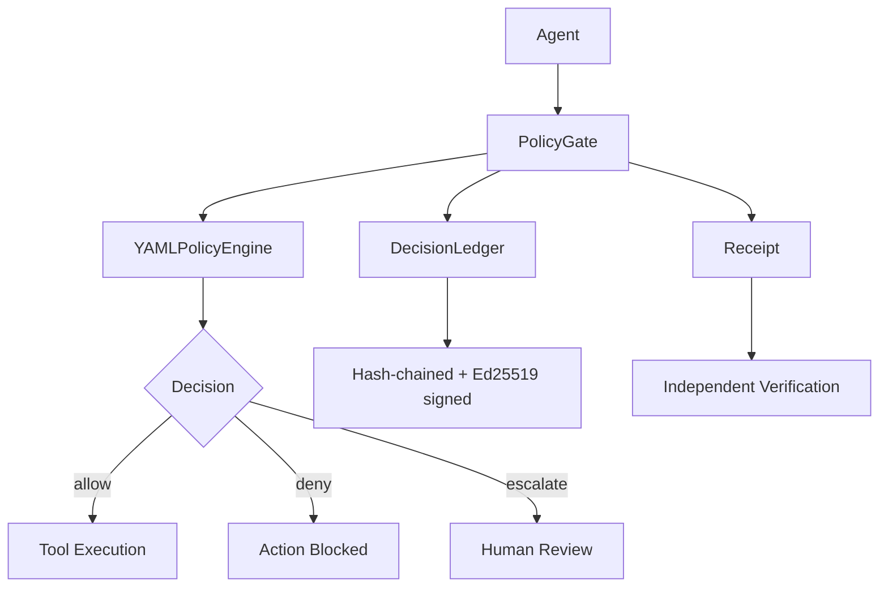

# PolicyBound

[](https://github.com/ikilic-tech/policybound/actions/workflows/ci.yml)
[](https://github.com/ikilic-tech/policybound/actions/workflows/codeql.yml)
[](https://pypi.org/project/policybound/)
[](https://pypi.org/project/policybound/)
[](LICENSE)

PolicyBound is an open-source policy enforcement and auditing layer for AI agents. It evaluates every agent action against declarative YAML rules, records each decision in a tamper-evident ledger, and generates cryptographically signed receipts that can be verified independently.

```
pip install policybound
```

---

## Why PolicyBound?

AI agents are making consequential decisions — accessing databases, processing payments, modifying records. As agents gain autonomy, organizations need answers to basic governance questions:

> *What did the agent do? Was it authorized? Can we prove it?*

PolicyBound provides three primitives that answer these questions without requiring a full governance platform or vendor lock-in:

1. **Policy Gate** — Evaluate every agent action against declarative rules before execution
2. **Decision Ledger** — Record every decision in a hash-chained, signed audit log
3. **Verifiable Receipts** — Generate portable, cryptographically signed proof of each decision

## Architecture



Every call to `PolicyGate.check()` evaluates the action against the policy, records the decision in the ledger, and returns a signed receipt — in a single method call.

## Quick Start

### 1. Define a Policy

Create `policybound.yaml`:

```yaml
policy:
  name: production-agent
  version: "1"
  default: deny

rules:
  - name: deny-production-delete
    action: deny
    when:
      tool: database.delete
      environment: production

  - name: require-approval-for-refund
    action: escalate
    when:
      tool: payments.refund
      amount:
        gt: 1000

  - name: allow-crm-read
    action: allow
    when:
      tool: crm.read

  - name: allow-crm-update
    action: allow
    when:
      tool: crm.update
```

### 2. Enforce the Policy

```python
from policybound import PolicyGate

gate = PolicyGate.from_file("policybound.yaml")

result = gate.check(
    agent="sales-agent",
    tool="crm.update",
    arguments={"customer_id": "123"},
)

if result.allowed:
    execute_tool(...)
elif result.escalated:
    request_human_approval(result)
else:
    log_denial(result)
```

### 3. Verify a Receipt

Every decision produces a receipt that can be saved, transferred, and verified independently:

```python
from policybound import verify_receipt, load_receipt
from policybound.receipt import save_receipt

# Save the receipt from a gate result
save_receipt(result.receipt, "receipt.json")

# Later, verify it independently
receipt = load_receipt("receipt.json")
verification = verify_receipt(receipt)

if verification.valid:
    print(f"Verified: {verification.agent} -> {verification.tool}")
    print(f"Verdict: {verification.verdict}")
else:
    print(f"Verification failed: {verification.error}")
```

## CLI

PolicyBound includes a CLI for policy management and auditing:

```bash
# Initialize a new project with policy template and Ed25519 signing keys
policybound init

# Check an action against a policy
policybound check -p policybound.yaml -a my-agent -t crm.read

# Verify a decision receipt
policybound verify receipt.json

# Inspect the decision ledger
policybound audit --verify-chain

# Export ledger records to JSON
policybound export -o decisions.json
```

## Policy Language

Rules are evaluated in order — the first matching rule wins. If no rule matches, the `default` action applies.

| Condition | Example | Description |
|-----------|---------|-------------|
| Exact match | `tool: crm.read` | Exact string equality |
| Wildcard | `tool: crm.*` | Glob-style pattern matching |
| `gt`, `lt`, `gte`, `lte` | `amount: { gt: 1000 }` | Numeric comparison |
| `in`, `not_in` | `env: { in: [dev, staging] }` | Set membership |
| `pattern` | `tool: { pattern: 'crm\..*' }` | Regex match (pre-compiled, length-limited) |

Condition values are resolved from `tool` and `agent` fields first, then from `arguments`, then from `context`.

## Core Concepts

| Concept | Description |
|---------|-------------|
| `ActionRequest` | What an agent wants to do (agent, tool, arguments, context) |
| `Decision` | The governance verdict (allow, deny, escalate) with the matched rule |
| `PolicyGate` | Main entry point — evaluates policy, records decision, generates receipt |
| `YAMLPolicyEngine` | Evaluates actions against declarative YAML rules |
| `DecisionLedger` | Append-only, hash-chained, Ed25519-signed audit log (SQLite backend) |
| `GateResult` | Return value from `gate.check()` containing the decision, record, and receipt |
| `VerificationResult` | Result of verifying a receipt — includes decision details on success |

The `PolicyEngine` and `LedgerBackend` are both defined as protocols, allowing custom implementations.

## Framework Adapters

### Generic Python Wrapper

Wrap any function with policy enforcement:

```python
from policybound import PolicyGate
from policybound.adapters.wrapper import GovernedTool

gate = PolicyGate.from_file("policybound.yaml")

def send_email(to: str, subject: str, body: str) -> dict:
    ...

governed_send = GovernedTool(
    gate=gate,
    agent="email-agent",
    tool_name="email.send",
    func=send_email,
)

# Raises PolicyDeniedError if the policy denies the action
result, gate_result = governed_send(to="user@example.com", subject="Hello", body="...")
```

### LangChain

```python
from policybound import PolicyGate
from policybound.adapters.langchain import PolicyBoundCallbackHandler

gate = PolicyGate.from_file("policybound.yaml")
handler = PolicyBoundCallbackHandler(gate=gate, agent="my-agent")

agent.invoke({"input": "..."}, config={"callbacks": [handler]})
```

Requires: `pip install policybound[langchain]`

## Security

### Cryptographic Guarantees

| Guarantee | Mechanism |
|-----------|-----------|
| **Integrity** | SHA-256 content hashing detects modification of decision records |
| **Chain integrity** | Hash chaining detects insertion, deletion, or reordering of records |
| **Authenticity** | Ed25519 signatures prove a record was produced by the signing key holder |
| **Independent verification** | Receipts are self-contained and verifiable offline |

### Explicit Non-Guarantees

- A signed record does not prove the recorded action was correct or appropriate
- Legal non-repudiation depends on key management practices outside this library
- If the private signing key is compromised, an attacker can produce valid signatures
- The system cannot prove that all actions were recorded if the middleware is bypassed

See [SECURITY.md](SECURITY.md) for the full threat model and vulnerability reporting process.

### Failure Model

PolicyBound defaults to **fail-closed** behavior (`strict=True`). Any governance infrastructure failure — policy evaluation error, ledger write failure, signing failure — results in the action being denied.

### CI Security Tooling

- [CodeQL](https://github.com/ikilic-tech/policybound/actions/workflows/codeql.yml) — static analysis for security vulnerabilities
- [Bandit](https://bandit.readthedocs.io/) — Python-specific security linter
- [pip-audit](https://pypi.org/project/pip-audit/) — dependency vulnerability scanning
- [Gitleaks](https://gitleaks.io/) — secret detection in source and history
- [Dependabot](https://docs.github.com/en/code-security/dependabot) — automated dependency updates
- Trusted Publishing via OIDC — no long-lived PyPI credentials

## Testing

```
121 tests | 87% coverage | Python 3.10–3.13
```

The test suite includes unit tests for every module, integration tests for the full governance flow, and dedicated security tests covering concurrent ledger writes, cryptographic edge cases, receipt tampering detection, and YAML injection prevention.

```bash
pytest --cov=policybound --cov-report=term-missing
ruff check src/ tests/
mypy src/
```

## Project Status

PolicyBound v0.1.0 is the first public release. It is an alpha-stage library intended for evaluation and feedback. The API may change in future versions.

### Known Limitations

- Decision ledger uses SQLite (single-process writes; not suited for high-concurrency without an external backend)
- No built-in key rotation mechanism
- No real-time policy hot-reloading (requires re-initialization)
- Receipt verification requires access to the public key
- The YAML policy engine covers common cases; complex logic may require a custom `PolicyEngine` implementation

### Roadmap

- PostgreSQL ledger backend
- Policy hot-reloading
- Key rotation support
- Structured logging integration
- OpenTelemetry export
- Additional framework adapters

## Contributing

See [CONTRIBUTING.md](CONTRIBUTING.md) for development setup, coding standards, and the pull request process.

For security vulnerabilities, see [SECURITY.md](SECURITY.md).

## License

MIT License. See [LICENSE](LICENSE).

---

[PyPI](https://pypi.org/project/policybound/) · [Changelog](CHANGELOG.md) · [Security Policy](SECURITY.md) · [Contributing](CONTRIBUTING.md)
